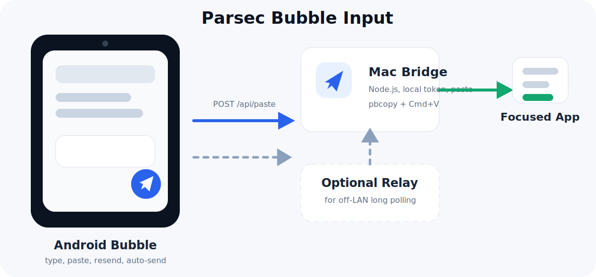
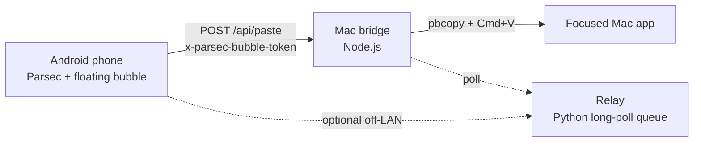

# Parsec Bubble Input

Android floating bubble input companion for Parsec on Mac.



Parsec is excellent for remote screen control, but text entry from a phone can be awkward: tiny remote input fields, hard-to-place cursors, and clumsy Chinese or long-form text input. Parsec Bubble Input adds a small Android overlay that lets you type or paste text on the phone and send it to a Mac bridge, which then pastes the text into the currently focused Mac window.

This is a small, practical open-source utility: one Android app, one lightweight Mac bridge, and an optional relay for off-LAN setups.

## Use Case

- You use Parsec on Android to control a Mac.
- You want to type Chinese, prompts, search queries, chat replies, or form content from the phone.
- You want to keep using the phone's keyboard, clipboard, or voice input while the Mac receives clean pasted text.

## Features

Android app:

- Floating bubble over Parsec or any other app
- Compact input panel
- Send current text
- Send clipboard text
- Resend last sent text
- Auto-send toggle
- Collapse back to bubble
- Stop/close the floating service
- Remember bubble position
- Clear permission and connection status

Mac bridge:

- Lightweight Node.js HTTP bridge
- Token-based access control
- Receives text and pastes it into the current focused Mac window
- Generates a local token automatically
- Works on LAN, Tailscale, or through the optional relay

Optional relay:

- Tiny Python long-poll relay for off-LAN use
- No persistent database
- Token required for both Android and Mac bridge

## Architecture



Direct LAN/Tailscale mode is the simplest:

```text
Android app -> Mac bridge -> focused Mac window
```

Relay mode is useful when the phone and Mac are not on the same network:

```text
Android app -> relay -> Mac bridge -> focused Mac window
```

## Repository Layout

```text
app/      Android app source
mac/      Local Mac bridge
relay/    Optional Python relay for off-LAN setups
```

## Requirements

- Android 8.0+ device
- Android Studio or an Android SDK with `ANDROID_HOME` configured
- Mac with Node.js 20+
- Parsec installed and configured separately
- macOS Accessibility permission for the terminal/app that runs the Mac bridge
- Optional: a VPS or always-on host for the relay

## Quick Start: Mac Bridge

From the repository root:

```sh
cd mac
./start-bridge.sh
```

The script copies the bridge into:

```text
~/Library/Application Support/ParsecBubbleInput
```

It prints:

- local URLs your Android phone can use
- the generated token file path
- the generated token

Example:

```text
Phone/App: http://192.168.1.10:8765
Token file: ~/Library/Application Support/ParsecBubbleInput/.token
Token: <generated-token>
```

Use the printed URL and token in the Android app.

To stop the bridge:

```sh
cd mac
./stop-bridge.sh
```

### Mac Permissions

The bridge pastes by running:

```text
pbcopy + Cmd+V via osascript/System Events
```

macOS may block this until you grant Accessibility permission to the terminal or shell process that runs the bridge.

Open:

```text
System Settings -> Privacy & Security -> Accessibility
```

Then allow your terminal app or the runtime you use to launch the bridge.

## Mac Bridge Configuration

The bridge can be configured through environment variables or:

```text
~/Library/Application Support/ParsecBubbleInput/bridge.env
```

Start from:

```sh
cp mac/bridge.env.example mac/bridge.env
```

Important variables:

```env
PBI_HOST=0.0.0.0
PBI_PORT=8765
PBI_TOKEN=change-me-to-a-long-random-string
PBI_RELAY_URL=https://your-relay.example.com
```

If `PBI_TOKEN` is omitted, the bridge generates a private token at:

```text
~/Library/Application Support/ParsecBubbleInput/.token
```

## Quick Start: Android App

Build a debug APK:

```sh
./gradlew :app:assembleDebug
```

Install it:

```sh
adb install -r app/build/outputs/apk/debug/app-debug.apk
```

On the phone:

1. Open **Parsec Bubble Input**.
2. Enter the Mac bridge URL, for example `http://192.168.1.10:8765`.
3. Enter the access token printed by `mac/start-bridge.sh`.
4. Tap **悬浮窗授权** and allow "Display over other apps".
5. Return to the app and tap **启动悬浮球**.
6. Open Parsec.
7. Tap the floating bubble, type or paste text, and send.

## Optional Relay Setup

The relay is only needed when Android cannot reach the Mac directly.

On the relay host:

```sh
sudo mkdir -p /opt/parsec-bubble-relay
sudo cp relay/relay.py /opt/parsec-bubble-relay/relay.py
sudo cp relay/parsec-bubble-relay.service.example /etc/systemd/system/parsec-bubble-relay.service
sudo cp relay/relay.env.example /etc/parsec-bubble-relay.env
sudo nano /etc/parsec-bubble-relay.env
sudo systemctl daemon-reload
sudo systemctl enable --now parsec-bubble-relay
```

Use the same `PBI_TOKEN` on:

- Android app
- Mac bridge
- relay host

Set the Mac bridge relay URL:

```env
PBI_RELAY_URL=http://your-relay-host:8765
```

Then point the Android app to the relay URL instead of the Mac LAN URL.

## API

Send text:

```http
POST /api/paste
x-parsec-bubble-token: <token>
content-type: application/json

{"text":"hello from Android"}
```

Health check:

```http
GET /api/health
```

## Security Notes

- Do not commit `bridge.env`, `.token`, relay env files, logs, or APKs.
- Use a long random token.
- Prefer LAN or Tailscale for private use.
- If exposing a relay publicly, put it behind HTTPS and a firewall where possible.
- The Mac bridge pastes into the currently focused window; only run it on a Mac you control.

## FAQ

### Does this replace Parsec?

No. Parsec handles screen streaming and remote control. This project only improves text input from Android to Mac.

### Can I use Android voice input?

Yes. The app uses a normal Android text field, so you can use your keyboard's built-in microphone/voice input and then send the recognized text to the Mac.

### Why not use the Android keyboard inside Parsec?

For short text it may be fine. This tool is for longer text, Chinese input, prompt writing, clipboard snippets, and cases where placing the cursor in a tiny remote UI is painful.

### Why does the Mac bridge need Accessibility permission?

It uses macOS automation to press `Cmd+V` after copying text into the pasteboard. macOS requires explicit permission for simulated keystrokes.

### The Android app says sent, but nothing appears on Mac.

Check:

1. The Mac bridge is running: `curl http://localhost:8765/api/health`
2. The Android URL points to the Mac or relay.
3. The token matches.
4. The intended Mac app has focus.
5. macOS Accessibility permission is granted.

## Why This Is Useful OSS

Parsec Bubble Input is intentionally small, but it solves a real workflow gap:

- remote desktop from a phone is increasingly common
- text input is often the weakest part of phone-to-desktop control
- the implementation is understandable and self-hostable
- the architecture is easy to audit
- the project can be extended without depending on a large backend

It is not a concept stub; it includes a working Android overlay, a runnable Mac bridge, token-based security, optional relay support, and documentation for others to clone and run.

## License

MIT

## Disclaimer

This project is not affiliated with Parsec, Unity, Apple, or OpenAI. Parsec is referenced only to describe the workflow this companion tool is designed for.
